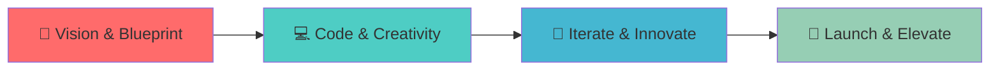

# 
🚀 Welcome to Immanuel Github 🚀

  

  

## &nbsp;***About Me***

 
<em><b>PPLG Student at SMK Bakti Nusantara 666</b> </em>

- 🔭 I'm currently working on **GameLib** - Personal Game Library & Tracker
- 🌱 I'm currently learning **Next.js & Tailwind CSS**
- 👯 I'm looking to collaborate on **Open Source Projects**
- 💬 Ask me about **PHP, React, Laravel, Flutter, Phalcon**
- ⚡ Fun fact: **I code better with chill beats playing! 🎵**
- 🎯 Goal: **Building digital solutions that make a difference**

  

## <b> Skills & Technologies</b>

  

  
  
  
  
  
  
  
  
  
  

  

## <b> Featured Projects </b>

  <table>
    <tr>
      <td width="50%">
        <h3 align="center">🎮 Game Tracker - Personal Library</h3>
        
  
          
            
          
<strong>🚀 React • CSS • JavaScript</strong>

          
Platform personal buat nyatet dan monitoring daftar game yang lagi dimainin atau udah tamat. Fokus ke UI yang clean!

        

      </td>
      <td width="50%">
        <h3 align="center">☕ Cafe Tahura - POS System</h3>
        
  
          
            
          
<strong>⚡ Phalcon Framework • PHP • MySQL</strong>

          
Sistem Point of Sale (Kasir) yang gue bangun pas lagi magang. Pake Phalcon biar performanya kenceng buat transaksi!

        

      </td>
    </tr>
    <tr>
      <td width="50%">
        <h3 align="center">🏆 Web Programming - Laravel Expert</h3>
        
  
          
            
          
<strong>🎨 Laravel • PHP • Bootstrap</strong>

          
Project juara 1 lomba Web Programming tingkat SMK. Nunjukin implementasi CRUD dan logic backend yang solid.

        

      </td>
      <td width="50%">
        <h3 align="center">🛠️ Minecraft Server - Modding</h3>
        
  
          
            
          
<strong>📚 Java • Forge • Fabric</strong>

          
Eksperimen konfigurasi server Minecraft, optimasi plugin (Geyser, EssentialsX), dan setup modpack custom.

        

      </td>
    </tr>
  </table>

  

## &nbsp;***My Development Process***

  

  

## <b> GitHub Analytics </b>

  

  

  

  

## <b> Let's Connect!</b>

  
  
  
  

  

---

  
  

  <h2>🎵 "Code better with chill beats" 🎵</h2>
  

  

